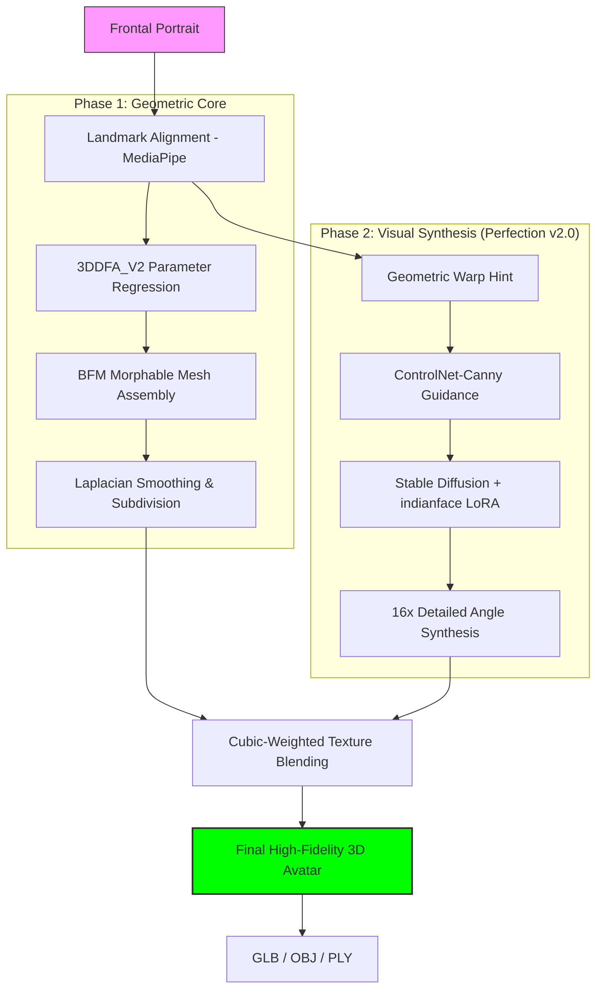
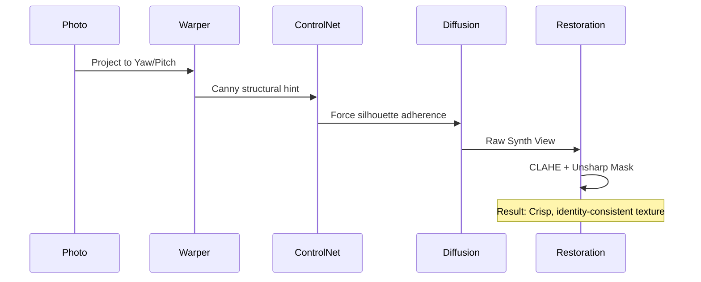

# 🇮🇳 Indian Avatar AI: Single Image to Stylized 3D (Perfection v2.0)

> **A high-fidelity AI framework for creating premium, stylized 3D avatars, specifically engineered to capture the geometric and cultural nuances of the Indian demographic.**

---

## � Project Objective
The primary objective of **Indian Avatar AI** is to solve the **"Representation Gap"** in global facial AI. Most state-of-the-art 3D reconstruction models are trained on Western datasets, leading to poor accuracy in predicting Indian facial morphology, skin tones, and cultural aesthetics (jewelry, clothing).

This project provides a research-grade pipeline that:
1.  **Preserves Identity**: Uses landmark-guided 3DMM regression to capture exact facial proportions.
2.  **Enhances Quality**: Transforms raw "faceted" meshes into smooth, premium surfaces via **Perfection v2.0** algorithms.
3.  **Cultural Intelligence**: Injects Indian aesthetics into 2D and 3D outputs using specialized **LoRAs**.
4.  **Hardware Accessibility**: Optimized to run on **4GB VRAM consumer GPUs** (RTX 3050+) without sacrificing results.

---

## 🏗️ System Architecture & Workflows

### 1. The "Reconstruct-Synthesize-Refine" Loop
The system operates as a data-parallel pipeline where geometry and texture are optimized simultaneously:



### 2. Multi-View ML logic
We use a **Structural Guidance Sequence** to ensure identity preservation at 90° and back views.



---

## �️ Technical Stack: The "Why"

| Library | Why We Used It | Role |
| :--- | :--- | :--- |
| **3DDFA_V2** | Best trade-off between speed (30+ FPS) and semantic landmark accuracy for unconstrained photos. | Core 3DMM Regression |
| **BFM 2009** | Broad topological support and compatibility with standard UV maps for face texturing. | Base Morphable Model |
| **ControlNet-Canny** | Essential to prevent AI "hallucination"—it forces the AI to follow the exact geometric shape of the head. | Structural Synthesis |
| **Lykon/AnyLoRA** | Extremely stable and photorealistic base model that handles stylization (LoRA) without color drift. | Base Diffusion Model |
| **Trimesh** | Robust handling of manifold checks, smoothing types, and subdivision without the overhead of Blender. | Geometry Processing |
| **MediaPipe** | Extremely fast CPU-based face detection and 468-point landmarking. | Pre-processing & ROI |
| **Gradio 5.x** | Allows for high-interactivity sliders and real-time canvas updates for parameter tuning. | Interactive Frontend |

---

## 🔬 ML Pipeline Deep Dive

### 🌀 1. Perfection v2.0: Mesh Refinement
Raw 3DMM outputs are often "pointy" or low-poly. Our **Perfection** pass includes:
*   **Loop Subdivision**: Interstitial vertices are mathematically interpolated, increasing surface resolution by 4x.
*   **Laplacian Smoothing**: We solve the differential equation $\Delta X = 0$ on the mesh to remove noise while keeping the volume consistent with the user's face.

### � 2. ControlNet Guided Synthesis
Side views (Yaw 45-90°) are traditionally hard. We solve this by:
1.  **Geometric Hinting**: We warp the front photo to the target angle.
2.  **Canny Guidance**: We extract the edges of that warp.
3.  **Structural Control**: ControlNet uses these edges as a "stencil," ensuring the AI doesn't change the person's jawline or nose shape during synthesis.

### 🎨 3. Intelligent Texture Composer
To avoid the "seam" problem where different views meet:
*   **Brightness Normalization**: Every view is histogram-matched to the front photo.
*   **Cubic Weighting**: $Weight = confidence^{3.0}$ — this sharply prioritizes the best camera for each pixel, eliminating the "ghosting" or "double-nose" effect.

---

## � Current Project Status
- [x] **Core Recontruction**: 3DDFA_V2 + BFM Pipeline functional.
- [x] **Perfection v2.0**: Laplacian smoothing and subdivision implemented.
- [x] **16+ View Synthesis**: ControlNet-guided engine fully operational.
- [x] **High-Res Texture**: Seamless blending with brightness normalization verified.
- [x] **Interactive UI**: Slider-based preview and BFM tuning live.
- [x] **Optimization**: 4GB VRAM sequential offloading active.

---

## 🚀 Installation & Quick Start

```powershell
# 1. Setup Virtual Environment
python scripts/setup_venv.py

# 2. Run the App
python app.py
```

---

## 📄 References & Credits
*   **3DDFA**: cleardusk/3DDFA_V2
*   **BFM**: Basel Face Model 2009
*   **Synthesis**: lllyasviel/ControlNet-Canny
*   **Dataset**: IMFDB (Indian Movie Face Database)

---
*Developed with ❤️ by the GUNI Research Intern Team*
