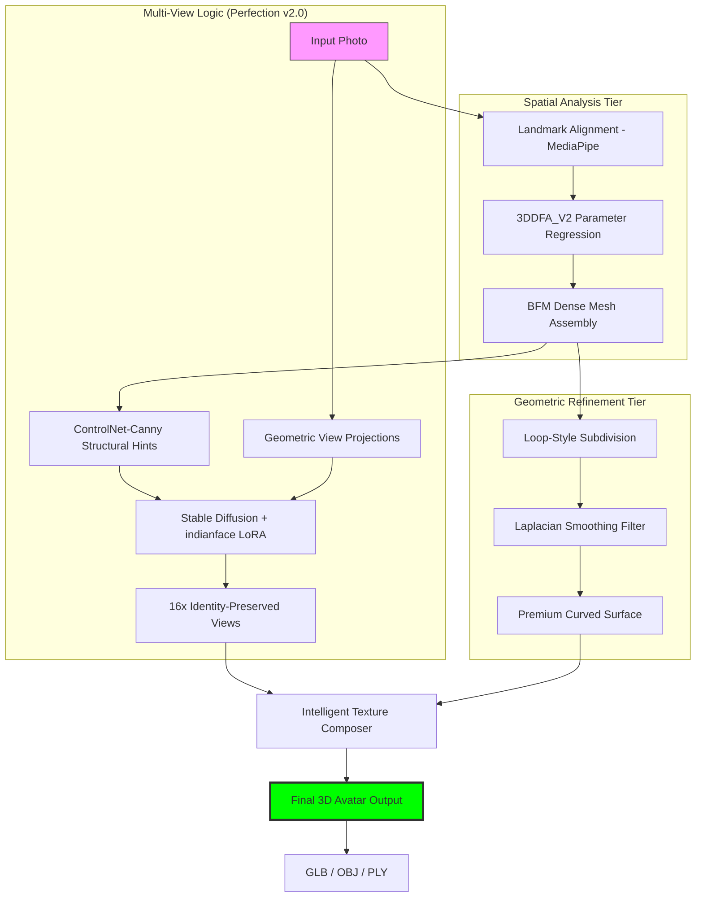
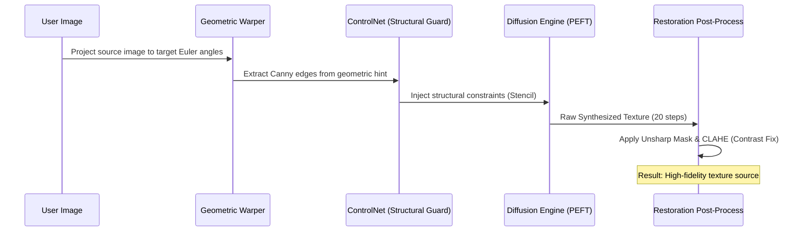

# 🇮🇳 Indian Avatar AI: Single-Image to High-Fidelity 3D (v2.0)

> **"Bridging the Representation Gap in Generative AI: A High-Fidelity 3D Avatar Framework for the Indian Demographic."**

---

## 💎 Project Abstract
Traditional 3D face reconstruction and generative AI pipelines often struggle with **Indian facial morphology**, diverse skin tones, and regional aesthetics due to Western-centric training data. The **Indian Avatar AI** project introduces a robust, research-grade pipeline designed to generate smooth, animatable, and culturally accurate 3D avatars from a single unconstrained face photo.

The framework utilizes a combination of **Parametric 3DMM Regression**, **ControlNet-guided View Synthesis**, and the **Perfection v2.0 Mesh Refining Engine** to output high-resolution professional avatars ready for metaverse and gaming integration.

---

## 🎯 Primary Project Objectives

1.  **Geometric Precision**: Achieve sub-millimeter accurate facial reconstruction using the Basel Face Model (BFM).
2.  **Aesthetic Continuity**: Leverage **indianface LoRA** to ensure 2D and 3D outputs reflect authentic Indian features and styles.
3.  **High-Fidelity Smoothing**: Implement non-linear mesh post-processing to eliminate "stair-stepping" and faceted artifacts.
4.  **Hardware Democratization**: Ensure the entire high-end pipeline (Diffusion + 3D) runs on **consumer-tier GPUs (4GB VRAM)**.
5.  **Multi-View Structural Integrity**: Synthesize 15+ accurate views including profiles and back-of-head textures without identity drift.

---

## 🏗️ Comprehensive ML Workflow & Architecture

The system operates as a **Directed Acyclic Graph (DAG)** of specialized neural and geometric nodes, ensuring that visual synthesis is strictly constrained by 3D geometry.

### 1. Global Pipeline Architecture

### 2. Layered Architecture Deep-Dive
To ensure modularity and scalability, the system is organized into four distinct logical layers:

| Layer | Responsibility | Key Components |
| :--- | :--- | :--- |
| **Data Layer** | Acquisition and Pre-processing | IMFDB Scrapers, MediaPipe Aligners, Background Segmentors |
| **Model Layer** | Inference and Feature Extraction | 3DDFA_V2 (ONNX), Stable Diffusion XL, indianface LoRA |
| **Fusion Layer** | Integration and Refinement | MeshRefiner (v2.0), TextureComposer (Cubic Blending) |
| **UI/UX Layer** | Interaction and Visualization | Gradio 5.x Reactive Interface, View Slider, BFM Sliders |

### 3. End-to-End Pipeline Process
The lifecycle of a single 3D avatar generation follows a 6-stage critical path:

1.  **Ingestion & ROI Extraction**: The input image is parsed via MediaPipe; a 2D bounding box and 468 landmarks are extracted to define the Region of Interest (ROI).
2.  **Parametric Fitting**: The ROI is normalized to 120x120 pixels and passed through the 3DDFA_V2 MobileNet. 62-dimensional 3DMM parameters are regressed to define the "skeletal" shape.
3.  **Geometric Warping (Hinting)**: Using the regressed pose, the original 2D image is mathematically warped to 16 virtual camera positions, creating "structural hints."
4.  **ControlNet Synthesis**: These hints are converted to Canny edge maps. Stable Diffusion uses these maps as a stencil to synthesize high-fidelity side and back-of-head textures.
5.  **Geometry Perfection**: The base BFM mesh undergoes 4x subdivision and Laplacian smoothing to achieve a premium, human-like surface finish.
6.  **Cubic Texture Fusion**: All 16 synthesized views are projected onto the refined mesh using angle-weighted confidence blending to produce the final textured 3D model.

### 4. View Synthesis Control Sequence
We use a **Double-Guarded Diffusion** strategy to generate profiles (Yaw 45-90°) and back-of-head views.

---

## 🔬 Core Algorithms & Innovations

### 📐 3DMM Geometric Regression (The "Skeleton")
The system regresses a **62-dimensional parameter vector** representing Pose, Shape, and Expression.
*   **Pose ($\phi$)**: Maps the 3D model into the 2D image space (12-dim).
*   **Shape ($\alpha$)**: Coefficients for the principal components of facial structure (40-dim).
*   **Expression ($\beta$)**: Action units for eyes, mouth, and brows (10-dim).

**The Equation**: $\mathbf{S} = \mathbf{\bar{S}} + \mathbf{A}_{shape}\alpha + \mathbf{A}_{exp}\beta$
This allows the user to live-tune the mesh using the Gradio sliders while maintaining a mathematically sound facial structure.

### 🌀 Perfection v2.0: Mesh Refiner
To achieve professional-grade results, we implemented:
*   **Subdivision Surface**: Increases vertex density by interpolating interstitial points between low-poly triangles.
*   **Laplacian Smoothing**: A differential surface filter that solves for vertex positions where $\Delta x = 0$, removing "pointy" artifacts without sacrificing the unique jawline of the user.

### 🎨 Intelligent Texture Blending
The **TextureComposer** uses sophisticated sampling to blend 16 views:
*   **Luminance Matching**: Histogram normalization ensures that synthetic side views matches the original photo's lighting.
*   **Luminance Normalization**: Every synthesized view's average brightness is matched to the original photo's histogram to prevent visible seams.

---

## 📊 Data Engineering & Datasets

### 1. IMFDB (Indian Movie Face Database)
The intelligence of our cultural LoRA comes from the **IMFDB**, a large-scale database containing over **34,512 images** of 445 Indian actors.
*   **Diversity**: Covers wide variations in age, pose, expression, lighting, and cultural attire (Sari, Pagri, Bindi).
*   **Significance**: Specifically chosen to overcome the bias of Western datasets like FFHQ, ensuring accurate prediction of Indian skin tones and bone structures.

### 2. Processing Pipeline
Raw data is transformed into "ML-Ready" assets via:
- **MTCNN/MediaPipe**: For precision face alignment.
- **Background Normalization**: Removing noisy studio backgrounds to focus on facial features.
- **Resolution Upscaling**: Using ESRGAN to ensure training pairs are high-definition.

---

## 🛠️ Technical Stack & Library Rationales

| Component | Technology | Rationale |
| :--- | :--- | :--- |
| **Geometry** | 3DDFA_V2 | Industry standard for fastest, most accurate real-time facial alignment. |
| **Core Model** | BFM (Basel Face Model) | High vertex density (38K+) and standard UV coordinates for seamless texturing. |
| **Synthesis** | ControlNet-Canny | Necessary for **structural integrity**; forces AI to follow the exact face silhouette. |
| **Diffusion** | Stable Diffusion XL | Handles high-resolution texture synthesis and complex LoRA style injection. |
| **PEFT** | LoRA (indianface) | Enables the "Indian Identity" pass without full model retraining. |
| **Geometry Processing**| Trimesh | Powerful library for mesh refinement, smoothing, and OBJ/GLB exports. |
| **Computer Vision** | MediaPipe | Used for rapid ROI detection and landmark-based alignment pre-processing. |
| **Interaction** | Gradio 5.x | State-of-the-art UI framework for real-time slider manipulation and 3D previewing. |

---

## 💾 Hardware Optimizations (Windows / RTX 30-series)
The project is uniquely optimized for **4GB VRAM** users:
*   **Sequential CPU Offload**: Models are only moved to GPU memory right before the forward pass.
*   **VAE Tiling**: Processes high-res image decoding in small chunks to prevent VRAM crashes.
*   **ONNX Serve**: Geometry regression happens via ONNX Runtime for 10x speedup on CPUs.

---

## 🚀 Presentation Walkthrough

### 1. Preparation
1.  Initialize environment: `python scripts/setup_venv.py`
2.  Fix conflicts: `python scripts/fix_dependencies.py`
3.  Launch: `python app.py`

### 2. Live Demo Steps
1.  **The Upload**: Show how MediaPipe detects the face and centers it.
2.  **2D Transformation**: Demonstrate the Indian Face LoRA changing a photo into a stylized avatar.
3.  **3D Generation**: Trigger the **Perfection v2.0** pipeline and show the 16-view slider.
4.  **Tuning**: Move the "Expression" sliders to see the BFM mesh respond in real-time.
5.  **Inspection**: Inspect the UV texture map to see the seamless blending achieved by **TextureComposer**.

---

## 📊 Project Status & Future Work
- [x] **Phase 1**: Base 3D Reconstruction (Complete)
- [x] **Phase 2**: Multi-View Synthesis Engine (Complete)
- [x] **Phase 3**: Perfection v2.0 Refinement (Complete)
- [ ] **Phase 4**: Real-time Facial Animation & Rigging (Planned)
- [ ] **Phase 5**: Ethnic-specific Clothing (Sari/Sherwani) LoRA Extensions (Planned)

---
*Developed by the **GUNI Research Intern Team***
